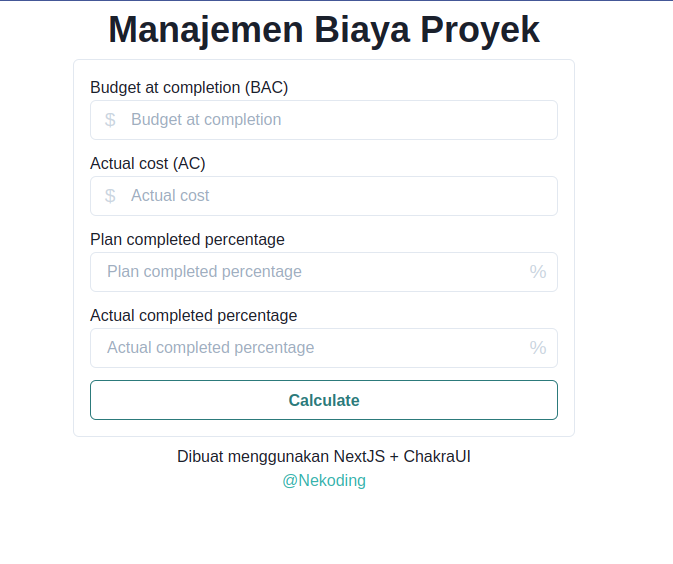

## Manajemen Biaya Proyek



Aplikasi web sederhana untuk menghitung estimasi biaya proyek dari materi kuliah Project Management.
```
Harap hitung ulang pekerjaan anda, saya tidak bertanggung jawab apabila terjadi kesalahan perhitungan
```

Aplikasi ini dibuat menggunakan NextJS dan ChakraUI

## Menjalankan aplikasi

Sebelum memulai pastikan anda sudah menginstall NodeJS dan NPM di perangkat anda.

1. Lakukan git clone 

```bash
git clone https://github.com/nekoding/manajemen-biaya-proyek.git
```

2. jika sudah install package yang dibutuhkan dengan cara

```bash
cd manajemen-biaya-proyek
npm install
```

3. Lalu jalankan perintah dibawah ini untuk menjalankan aplikasi

```bash
npm run dev
# atau
yarn dev
```
